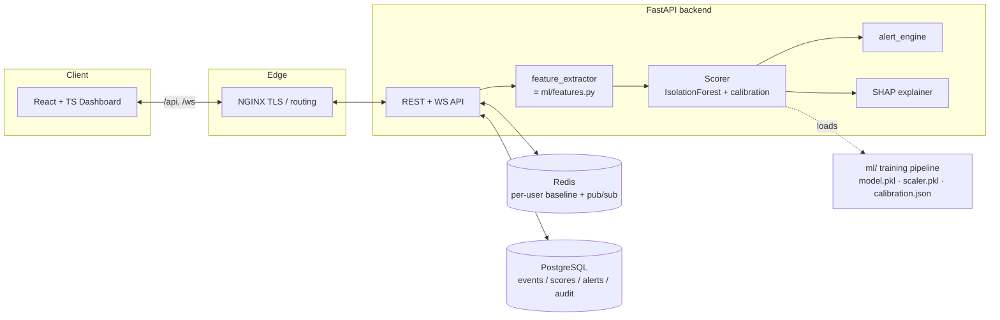

# ATOShield 🛡️

**Real-time account takeover (ATO) detection using unsupervised ML + behavioral analytics.**

[](https://github.com/nehal2905/ATOShield/actions/workflows/ci.yml)

ATOShield scores every login with a genuinely trained **Isolation Forest** against a
**per-user behavioral baseline** (IP/device history, login frequency, geo-velocity, failed
attempts). It is a full system — ML pipeline, async FastAPI backend, Redis-backed state,
a JWT-protected React dashboard with live WebSocket updates, and one-command Docker
deployment — not a model bolted onto a CRUD app.

> The model produces the risk score. The per-feature "why" overlay (SHAP / additive) is
> **explainability only** and never replaces the model output.

---

## Architecture



**Scoring path:** `read baseline (Redis) → compute features → score (IsolationForest) →
calibrate to 0–100 → classify tier → SHAP attribution → persist (Postgres) → broadcast (WS)`.
Model artifacts load **once at startup**; scoring is **< 100 ms**.

---

## Repository layout

```
ml/         training pipeline (features, dataset, train, evaluate, explain) + tests
backend/    FastAPI app (core scoring, db, cache, api, ws) + Alembic + tests
frontend/   React + TS + Vite + Tailwind + Recharts dashboard + Vitest
nginx/      reverse proxy (TLS, /api, /ws, /)
scripts/    event_generator.py — live demo traffic
```

---

## Quick start

### 1. Configure
```bash
cp .env.example .env
# edit .env: set strong POSTGRES_PASSWORD, JWT_SECRET, BOOTSTRAP_ADMIN_PASSWORD
python -c "import secrets; print(secrets.token_urlsafe(48))"   # for JWT_SECRET
```

### 2. Train the model (produces ml/artifacts/*)
```bash
cd ml
pip install -r requirements.txt
python generate_dataset.py        # normal.parquet + labeled_test.parquet
python train.py                   # model.pkl, scaler.pkl, calibration.json
python evaluate.py                # eval_report.md + pr_threshold.png  (REAL metrics)
cd ..
```

### 3. Run everything
```bash
docker compose up --build
# dashboard:  http://localhost
# API docs:   http://localhost/api/docs
# log in with BOOTSTRAP_ADMIN_USERNAME / BOOTSTRAP_ADMIN_PASSWORD from .env
```

### 4. Generate live traffic (optional)
```bash
python scripts/event_generator.py --url http://localhost \
    --user admin --password <ADMIN_PASSWORD> --rate 1.5
```

### Local dev (without Docker)
```bash
# backend
cd backend && pip install -r requirements.txt
uvicorn app.main:app --reload          # needs Postgres + Redis (or sqlite fallback)
# frontend
cd frontend && npm install && npm run dev   # http://localhost:5173 (proxies to :8000)
```

---

## The six behavioral features

| # | Feature | Encoding | Why |
|---|---|---|---|
| 1 | Login hour | `sin/cos(2π·h/24)` (cyclic) | 23:00 and 00:00 are "close" |
| 2 | IP change | 0 known / 1 new (vs baseline set) | new network is a weak signal |
| 3 | Device change | 0 known / 1 new | new device is a weak signal |
| 4 | Login frequency | logins in trailing 60-min window | bursts ⇒ automation |
| 5 | Geo-velocity | `haversine(prev,cur) / Δt` (km/h, capped 5000) | **speed**, not mere location change |
| 6 | Failed attempts | count preceding success | brute force / stuffing |

`ml/features.py` is the **single source of truth**; the backend imports it, and
`backend/tests/test_feature_parity.py` enforces identical vectors.

---

## Honest metrics

We do **not** hardcode metrics. They are generated by `ml/evaluate.py` into
[`ml/artifacts/eval_report.md`](ml/artifacts/eval_report.md) (confusion matrix, precision,
recall, F1, ROC-AUC, per-attack-type recall, and a precision/recall-vs-threshold plot).

The numbers below are from a real run (10,000 normal training events; 3,000 test events
incl. 1,000 labeled attacks) at the default operating threshold (risk ≥ 60). Re-run step 2
to reproduce — they will vary slightly with the random seed/dataset size.

| Metric | Value |
|---|---|
| Precision | **0.926** |
| Recall | **0.850** |
| F1 | **0.886** |
| ROC-AUC | **0.978** |

Confusion matrix: TN = 1932, FP = 68, FN = 150, TP = 850.

Recall by attack type — credential stuffing **1.00**, impossible travel **1.00**,
new device/IP at odd hour **1.00**, **slow-burn 0.32**. The `slow_burn` class flips a
single behavioral signal at a time and is genuinely hard for an anomaly detector; its low
recall is **reported, not hidden** — that honesty is the point.

---

## Risk tiers (configurable in `.env`)

| Risk | Tier | Action |
|---|---|---|
| 0–24 | LOW | allow |
| 25–49 | MEDIUM | soft MFA (OTP) |
| 50–74 | HIGH | step-up auth |
| 75–100 | CRITICAL | block + lock + SOC alert |

Alerts fire at `ALERT_THRESHOLD` (default 60).

---

## Security

- JWT auth (httpOnly cookie) on all dashboard routes; bcrypt password hashing.
- Pydantic v2 validation on every input; rate limiting on `/api/events` and `/api/simulate`.
- Secrets only via `.env` (never committed); `.env.example` holds placeholders.
- NGINX terminates TLS in production.

See the in-app **About** page for the STRIDE-lite threat model and limitations.

## Tests

```bash
pytest ml/tests backend/tests -q     # Python (requires trained artifacts + Redis for some)
cd frontend && npm test              # Vitest
```

CI (GitHub Actions) lints and runs both suites on every push.

## License

MIT (for the portfolio/educational build).
